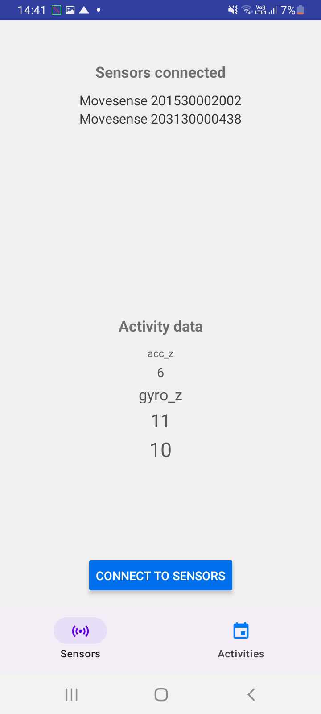
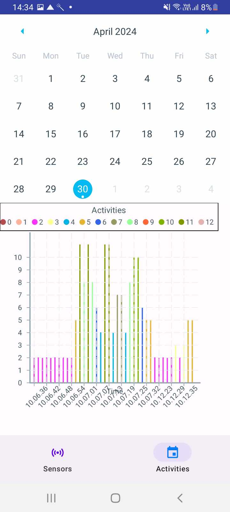

# Mobile Application Overview

## Introduction
This mobile application is developed as part of a master's thesis titled "Design and development of an interactive mobile application for wearable sensor data collection and visualization: A user-centric approach. The mobile application provides a user-friendly interface for connecting to Movesense sensors and visualizing activity data in real-time. It is designed primarily for Android devices, with iOS compatibility not currently supported.
Users can interact with the app to connect to Movesense sensors, which collect IMU6 data (3D acceleration and 3D gyroscope measurements), which further is processed through a machine learning (ML) model to enhance data interpretation. The processed data is visualized in real-time, offering immediate insights into the user's physical activities. The activity predicted by the ML model is then saved to the mobile phone's local storage. There is an "Activities" tab where all activities for a selected date is visualized, visualization is achieved through a graph.

## Features
- **Sensor Connection**: Users can connect to Movesense sensors. The application displays a list of all connected sensors.
- **Live Activity Data Feed**: The application processes raw IMU data from the connected sensors through a machine learning model and displays labeled activity data in real-time.
- **Activities Interface**: Features a calendar view where users can select a date to visualize activity data. Below the calendar, the activity data is presented graphically, similar to a graph format.

## Architecture
The application is built using React Native, allowing for a cross-platform mobile app development:
- **React Native App**: Handles most of the user interfaces for displaying sensor data and activities. Also takes care of saving and loading labeled activity data on the device local storage.
- **Android Native Code**:
  - `movesenseLog`: Manages Bluetooth connections to the sensors.
  - `MainActivity.kt`: Serves as the entry point of the Android application.
  - `ReactNativeBridge.kt`: Main module that bridges React Native with native Android functionalities. This module also is responsible for receiving sensor data from the movesenseLog, processing it, running the data through the MLModule and sending it to the React Native app.
  - `MLModule`: Interacts with the machine learning model located under `src/main/assets` to process the sensor data.

## Running the Application Locally
To run the application on your own computer, follow these steps:
1. Ensure you have all the necessary requirements installed to run a React Native application, including Node.js and Android Studio.
2. Clone the repository to your local machine.
3. Open a terminal and change directory (cd) to the root folder of the project.
4. Run `npm install` to install all dependencies.
5. Execute `npx react-native run-android` to start the application on an Android device or emulator.

## Creating a signed APK (package of the application, installable for android phones)
1. cd to the android folder
2. Run `gradle assembleRelease` to build the APK.
3. The APK will be located at `android/app/build/outputs/apk/release/app-release.apk`.
4. Transfer the APK to your android phone and install it.

## Note
This application is currently optimized for Android devices, and there is no support for iOS devices at this stage.
